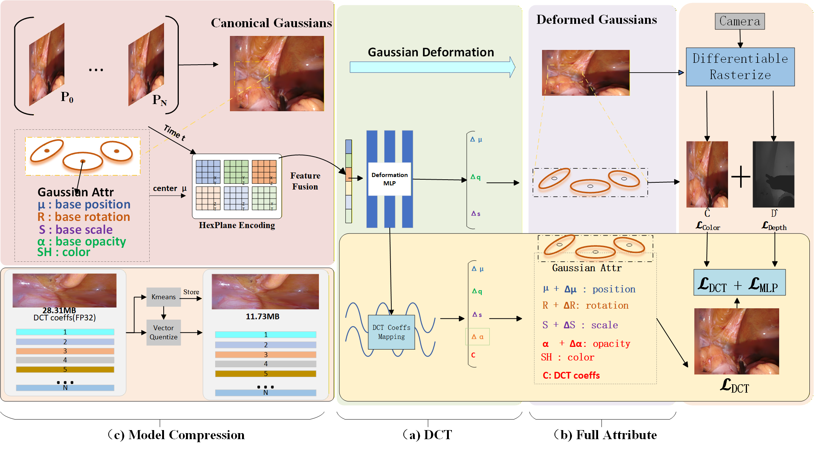
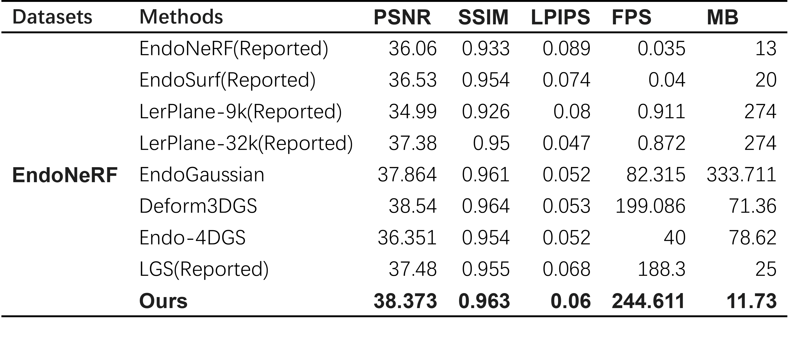

# EndoDCT

**EndoDCT: Real-time Dynamic Endoscopic Scene Reconstruction via DCT-based Trajectory Deformation**


---

## Method Overview



## Ablation Figure



## Visualization Results


---

## Dataset Structure

Place datasets under `assets/data/` with the following structure (relative to repo root):

```
assets/
  data/
    EndoNeRF/
      pulling_soft_tissues/
        images/
        depth/
        masks/
      cutting_tissues_twice/
        images/
        depth/
        masks/
    SCARED/
      dataset_1/
        keyframe_1/
          images/
          depth/
          masks/
        keyframe_2/
        keyframe_3/
    hamlyn_forplane/
      hamlyn_seq1/
        images/
        depth/
        masks/
```

Notes:
- Directory names must match the config files.
- Each sequence should contain `images/`, `depth/`, and `masks/`.
- Data loaders are defined in `scene/endo_loader.py`.

---

## Environment

```bash
# Activate environment before running
conda activate gaussian_splatting
```

---

## Training

Example (EndoNeRF, pulling):

```bash
python train.py --configs arguments/endonerf/pulling.py --model_path output/endonerf/pulling
```

---

## Rendering & Evaluation

```bash
# Render (generates test/ours_xxx)
python render.py --model_path output/endonerf/pulling --iteration 3000 --skip_train --skip_video --configs arguments/endonerf/pulling.py

# Metrics (PSNR/SSIM/LPIPS)
python metrics.py -m output/endonerf/pulling

# FPS benchmark
python bench_fps.py -m output/endonerf/pulling --iteration 3000 --split test --views 1 --warmup 10 --iters 200 --json
```

---

## Batch Evaluation (Excel Output)

```bash
# Evaluation only (no training)
python batch_dct_sr2.py --output_root output1 --skip_train --bench_warmup 50 --bench_iters 500 --out_xlsx im4.xlsx
```
