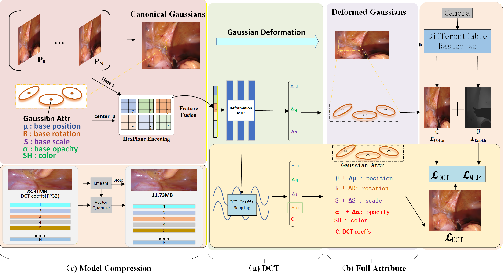
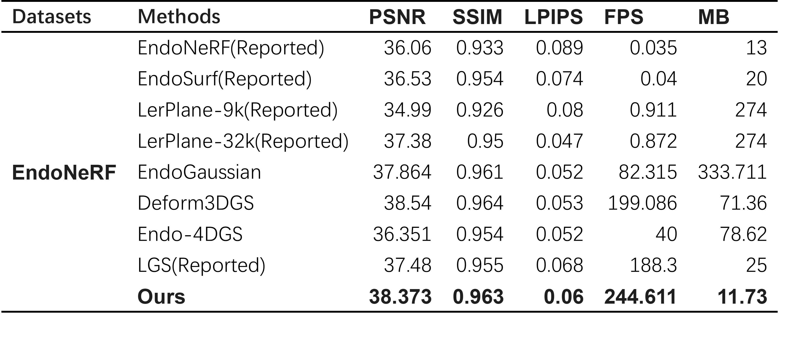
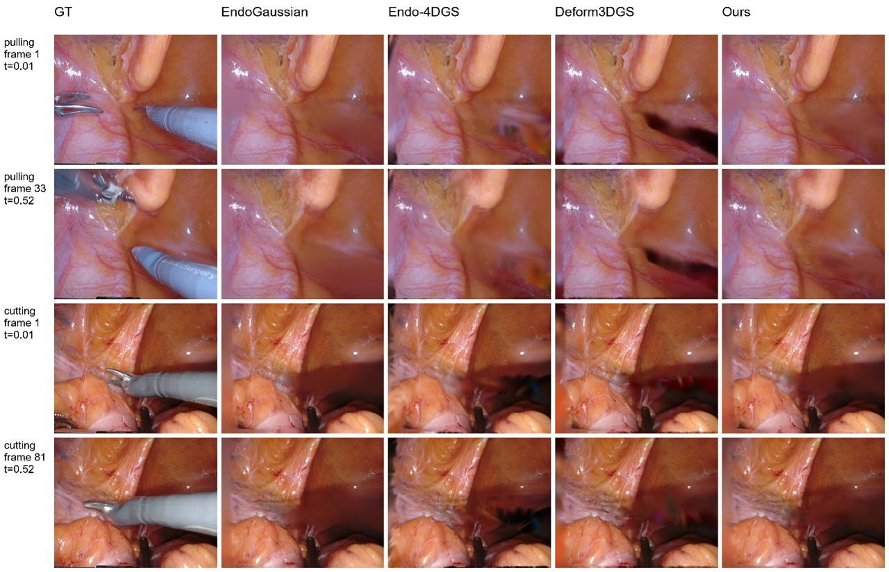

# EndoDCT

**EndoDCT: Real-time Dynamic Endoscopic Scene Reconstruction via DCT-based Trajectory Deformation**

This repository is a modified implementation based on EndoGaussian for real-time dynamic endoscopic scene reconstruction. The structure follows the style of the LGS repository, with a minimal reproducible pipeline below.

---

## Method Overview



## Ablation Figure



## Visualization Results



---

## Dataset Structure

Place datasets under `assets/data/` with the following structure (relative to repo root):

```
assets/
  data/
    EndoNeRF/
      pulling_soft_tissues/
        images/
        depth/
        masks/
      cutting_tissues_twice/
        images/
        depth/
        masks/
    SCARED/
      dataset_1/
        keyframe_1/
          images/
          depth/
          masks/
        keyframe_2/
        keyframe_3/
    hamlyn_forplane/
      hamlyn_seq1/
        images/
        depth/
        masks/
```

Notes:
- Directory names must match the config files.
- Each sequence should contain `images/`, `depth/`, and `masks/`.
- Data loaders are defined in `scene/endo_loader.py`.

Dataset sources:
Look https://github.com/CUHK-AIM-Group/EndoGaussian
EndoNeRF:
The dataset provided in EndoNeRF is used. You can download and process the dataset from their website (https://github.com/med-air/EndoNeRF). We use the two accessible clips including 'pulling_soft_tissues' and 'cutting_tissues_twice'.

SCARED:
The dataset provided in SCARED is used. To obtain a link to the data and code release, sign the challenge rules and email them to max.allan@intusurg.com. You will receive a temporary link to download the data and code. Follow MICCAI_challenge_preprocess to extract data.

Hamlyn (new):
The dataset provided in Forplane is used.https://github.com/Loping151/ForPlane Thanks for their efforts.
---

## Environment

PowerShell multiline (copy-paste ready):

```powershell
conda create -n EndoDCT python=3.7 -y `
  && conda activate EndoDCT `
  && pip install -r requirements.txt `
  && pip install -e submodules/depth-diff-gaussian-rasterization `
  && pip install -e submodules/simple-knn
```

---

## Training (Single Dataset)

Step 1: Train the baseline EndoGaussian (teacher).

```powershell
python train.py --configs arguments/endonerf/pulling.py `
  --model_path output/endonerf/pulling
```

Step 2: Distill into EndoDCT (best setting).

```powershell
python train.py --configs arguments/endonerf/pulling.py `
  --model_path output/endonerf/pulling_dct_sr2 `
  --distill_dct --teacher_model_path output/endonerf/pulling `
  --distill_iteration -1 --distill_iterations 6000 `
  --use_dct_deform --dct_use_scale --dct_use_rot `
  --dct_k 16 --dct_T 63 `
  --dct_lr_mult 140 --dct_xyz_lr_mult 0.01 `
  --distill_unfreeze_all --distill_unfreeze_lr_mult 0.01 `
  --distill_ssim_weight 0.0
```

---

## Training (All Datasets)

Batch training with the same setting (output to `output1/`):

```powershell
python batch_dct_sr2.py --output_root output1 `
  --distill_iterations 6000 --dct_k 16 --dct_lr_mult 140 --dct_xyz_lr_mult 0.01 `
  --distill_unfreeze_all --distill_unfreeze_lr_mult 0.01 `
  --distill_ssim_weight 0.0 --dct_use_scale --dct_use_rot
```

---

## Rendering & Evaluation (Single Dataset)

```powershell
python render.py --model_path output/endonerf/pulling_dct_sr2 `
  --iteration 6000 --skip_train --skip_video `
  --configs arguments/endonerf/pulling.py --use_dct_deform --dct_use_scale --dct_use_rot

python metrics.py -m output/endonerf/pulling_dct_sr2 ; `
  python bench_fps.py -m output/endonerf/pulling_dct_sr2 --iteration 6000 --split test --views 1 --warmup 50 --iters 500 --json
```

---

## Evaluation (All Datasets)

```powershell
python batch_dct_sr2.py --output_root output1 --skip_train `
  --bench_warmup 50 --bench_iters 500 --out_xlsx im4.xlsx
```
